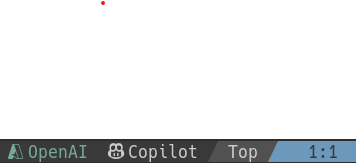
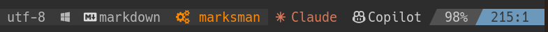

# Featues Overview
## Set Provider in your priority order
```lua
-- chat provider
provider = require("avante-status").get_chat_provider({
    "azure",    -- first priority
    "claude",   -- second priority
    "openai",   -- third priority
}),
-- suggestions provider
auto_suggestions_provider = require("avante-status").get_suggestions_provider({
    "azure",
    "copilot",
    "claude",
    "openai",
}),
```
## Display Active Provider in the status line





# Installation and Basic usage

## Set Provider in `avante.nvim spec`
You add following setting in your `avante.nvim` spec.

```lua
{
    "yetone/avante.nvim",
    dependencies = {
        -- other dependencies
        "takeshid/avante-status.nvim",
    },
    opts = function()
        require("avante").setup({
            provider = require("avante-status").get_chat_provider({
                "azure",
                "claude",
                "openai",
            }),
            auto_suggestions_provider = require("avante-status").get_suggestions_provider({
                "azure",
                "copilot",
                "claude",
                "openai",
            }),
        -- other opts
    end
}
```

<details>
<summary>See full spec</summary>

```diff
{
    "yetone/avante.nvim",
    enabled = true,
    event = "VeryLazy",
    lazy = false,
    version = false, -- set this if you want to always pull the latest change
    dependencies = {
        "nvim-treesitter/nvim-treesitter",
        "stevearc/dressing.nvim",
        "nvim-lua/plenary.nvim",
        "MunifTanjim/nui.nvim",
        --- The below dependencies are optional,
        "nvim-tree/nvim-web-devicons",
        "zbirenbaum/copilot.lua", -- for providers='copilot'
        "takeshid/avante-status.nvim",
        {
            "HakonHarnes/img-clip.nvim",
            event = "VeryLazy",
            opts = {
                default = {
                    embed_image_as_base64 = false,
                    prompt_for_file_name = false,
                    drag_and_drop = {
                        insert_mode = true,
                    },
                    use_absolute_path = true,
                },
            },
        },
    },
    build = "powershell -ExecutionPolicy Bypass -File Build.ps1 -BuildFromSource false",
    -- build = "make",
-   opts = {
+   opts = function()
+       require("avante").setup({
-           provider = "claude",
+           provider = require("avante-status").get_chat_provider({
+               "azure",
+               "claude",
+               "openai",
+           }),
-           auto_suggestions_provider = "copilot",
+           auto_suggestions_provider = require("avante-status").get_suggestions_provider({
+               "azure",
+               "copilot",
+               "claude",
+               "openai",
+           }),
            behaviour = {
                auto_suggestions = true,
                auto_set_highlight_group = true,
                auto_set_keymaps = true,
                auto_apply_diff_after_generation = true,
                support_paste_from_clipboard = true,
            },
            windows = {
                position = "right",
                width = 40,
                sidebar_header = {
                    align = "center",
                    rounded = false,
                },
                ask = {
                    floating = true,
                    start_insert = true,
                    border = "rounded"
                }
            },
            -- providers-setting
            claude = {
                model = "claude-3-5-sonnet-20241022", -- $3/$15, maxtokens=8192
                -- model = "claude-3-5-haiku-20241022", -- $1/$5, maxtokens=8192
                max_tokens = 8000,
            },
            copilot = {
                model = "gpt-4o-2024-05-13",
                max_tokens = 4096,
            },
            openai = {
                model = "gpt-4o", -- $2.5/$10
                -- model = "gpt-4o-mini", -- $0.15/$0.60
                max_tokens = 4096,
            },
            azure = {
-               endpoint = vim.fn.getenv("AZURE_OPENAI_ENDPOINT"),
+               endpoint = require("avante-status").getenv_if("AZURE_OPENAI_ENDPOINT", ""),
-               deployment = vim.fn.getenv("AZURE_OPENAI_DEPLOY"),
+               deployment = require("avante-status").getenv_if("AZURE_OPENAI_DEPLOY", ""),
                api_version = "2024-06-01",
                max_tokens = 4096,
            },
        })
-   }
+   end
}
```

</details>

## DisplayStatus Line in `lualine.nvim spec`
You add following setting in your `lualine.nvim` spec.

```lua
{
    "nvim-lualine/lualine.nvim",
    dependencies = {
        "nvim-tree/nvim-web-devicons",
        {
            "takeshid/avante-status.nvim",
            lazy = false,
        },
    },
    config = function()
        local lualine = require("lualine")
        -- other your components ... 
        local avante_chat_component = {
            function()
                local chat = require("avante-status").chat_provider
                local msg = chat.name
                return msg
            end,
            icon = require("avante-status").chat_provider.icon,
            color = { fg = require("avante-status").chat_provider.fg}
        }
        local avante_suggestions_component = {
            function()
                local suggestions = require("avante-status").suggestions_provider
                local msg = suggestions.name
                return msg
            end,
            icon = require("avante-status").suggestions_provider.icon,
            color = { fg = require("avante-status").suggestions_provider.fg }
        }
        local config = {
            options = {
                -- your options ... 
            },
            sections = {
                -- your sections ... 
                lualine_x = { 'encoding', 'fileformat', 'filetype', avante_chat_component, avante_suggestions_component },
                -- your sections ...
            },
            inactive_sections = {
                -- your seciotns  ...
            },
        }
        lualine.setup(config)
    end
}
```




# Who is `avante-status.nvim` for?
The most notable feature of `avante-status.nvim` is that it can set providers in order of priority.

`avante.nvim` is wonderfully compatible with many providers. However, there are times when you want to separate providers for private use and for groups you belong to.

- Use Claude, which you have personally contracted, in your private environment

- Use AzureOpenAI in your company

- Use LocalLLM server in another organization

In many cases, source code is confidential information, and sending it to a provider itself is a leak of information.

`avante-status.nvim` provides the functionality to set the appropriate provider while ensuring confidentiality.

# License
This project is licensed under the MIT License.
see [LICENSE](./LICENSE)
