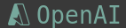

# Featues Overview
## Set Provider in your priority order
```lua
-- chat provider
provider = require("avante-status").get_chat_provider({
    "azure",    -- first priority
    "claude",   -- second priority
    "openai",   -- third priority
}),
-- suggestions provider
auto_suggestions_provider = require("avante-status").get_suggestions_provider({
    "azure",
    "copilot",
    "claude",
    "openai",
}),
```
## Display Active Provider in the status line


# Installation and Basic usage

## Setting provider with your priority
You add following setting in your `avante.nvim` spec.

```lua
{
    "yetone/avante.nvim",
    dependencies = {
        -- other dependencies
        "takeshid/avante-status.nvim",
    },
    opts = function()
        return {
            provider = require("avante-status").get_chat_provider({
                "azure",
                "claude",
                "openai",
            }),
            auto_suggestions_provider = require("avante-status").get_suggestions_provider({
                "azure",
                "copilot",
                "claude",
                "openai",
            }),
        -- other opts
    end
}
```


`avante-status.nvim` provides `getenv_if` function.
This function is well used for `Azure` or your custom provider.

```lua
---getenv_if(envname: string, F: string | nil): string
azure = {
    endpoint = require("avante-status").getenv_if("AZURE_OPENAI_ENDPOINT", ""),
    deployment = require("avante-status").getenv_if("AZURE_OPENAI_DEPLOY", ""),
    api_version = "2024-06-01",
    max_tokens = 4096,
}
```

`getenv_if(envname, F)` check `envname` environment variable, so return `envname` if the environment variable envname exists, return `F` if it don't exist.


<details>
<summary>See full spec</summary>

```diff
{
    "yetone/avante.nvim",
    enabled = true,
    event = "VeryLazy",
    lazy = false,
    version = false, -- set this if you want to always pull the latest change
    dependencies = {
        "nvim-treesitter/nvim-treesitter",
        "stevearc/dressing.nvim",
        "nvim-lua/plenary.nvim",
        "MunifTanjim/nui.nvim",
        --- The below dependencies are optional,
        "nvim-tree/nvim-web-devicons",
        "zbirenbaum/copilot.lua", -- for providers='copilot'
        "takeshid/avante-status.nvim",
        {
            "HakonHarnes/img-clip.nvim",
            event = "VeryLazy",
            opts = {
                default = {
                    embed_image_as_base64 = false,
                    prompt_for_file_name = false,
                    drag_and_drop = {
                        insert_mode = true,
                    },
                    use_absolute_path = true,
                },
            },
        },
    },
    build = "powershell -ExecutionPolicy Bypass -File Build.ps1 -BuildFromSource false",
    -- build = "make",
-   opts = {
+   opts = function()
+       return {
-           provider = "claude",
+           provider = require("avante-status").get_chat_provider({
+               "azure",
+               "claude",
+               "openai",
+           }),
-           auto_suggestions_provider = "copilot",
+           auto_suggestions_provider = require("avante-status").get_suggestions_provider({
+               "azure",
+               "copilot",
+               "claude",
+               "openai",
+           }),
            behaviour = {
                auto_suggestions = true,
                auto_set_highlight_group = true,
                auto_set_keymaps = true,
                auto_apply_diff_after_generation = true,
                support_paste_from_clipboard = true,
            },
            windows = {
                position = "right",
                width = 40,
                sidebar_header = {
                    align = "center",
                    rounded = false,
                },
                ask = {
                    floating = true,
                    start_insert = true,
                    border = "rounded"
                }
            },
            -- providers-setting
            claude = {
                model = "claude-3-5-sonnet-20241022", -- $3/$15, maxtokens=8192
                -- model = "claude-3-5-haiku-20241022", -- $1/$5, maxtokens=8192
                max_tokens = 8000,
            },
            copilot = {
                model = "gpt-4o-2024-05-13",
                max_tokens = 4096,
            },
            openai = {
                model = "gpt-4o", -- $2.5/$10
                -- model = "gpt-4o-mini", -- $0.15/$0.60
                max_tokens = 4096,
            },
            azure = {
-               endpoint = vim.fn.getenv("AZURE_OPENAI_ENDPOINT"),
+               endpoint = require("avante-status").getenv_if("AZURE_OPENAI_ENDPOINT", ""),
-               deployment = vim.fn.getenv("AZURE_OPENAI_DEPLOY"),
+               deployment = require("avante-status").getenv_if("AZURE_OPENAI_DEPLOY", ""),
                api_version = "2024-06-01",
                max_tokens = 4096,
            },
        }
-   }
+   end
}
```

</details>

## Display StatusLine Active Provider

### `lualine.nvim`  

`avante-status.nvim` provide `chat_component`, `suggestions_compoentj` for  `lualine.nvim`.

You add following setting in your `lualine.nvim` spec.

> **Recommend**
> Set event to 'VeryLazy'. 
> If you do not set it to VeryLazy, active provider may not be displayed correctly due to the timing of loading.

```lua
{
    "nvim-lualine/lualine.nvim",
    event = 'VeryLazy', -- recommeded
    dependencies = {
        "nvim-tree/nvim-web-devicons",
        "takeshid/avante-status.nvim",
    },
    config = function()
        local lualine = require("lualine")
        -- other your components ... 
        local avante_chat_component = require('avante-status.lualine').chat_component
        local avante_suggestions_component = require('avante-status.lualine').suggestions_component
        local config = {
            options = {
                -- your options ... 
            },
            sections = {
                -- your sections ... 
                lualine_x = {
                    'encoding',
                    'fileformat',
                    'filetype',
                    avante_chat_component,
                    avante_suggestions_component },
                -- your sections ...
            },
            inactive_sections = {
                -- your seciotns  ...
            },
        }
        lualine.setup(config)
    end
}
```


# Customizing

## Default Providers

`avante-status.nvim` provides default providers following like this.

| ProviderName | Display                    | Color                                                                  |
| ------       | --------                   | -----                                                                  |
| none         | None                       | <span style="background-color: #ffffff;color: "#000000">#ffffff</span> |
| azure        | Azure                      | <span style="background-color: #008ad7;color: "#ffffff">#008ad7</span> |
| claude       |  | #d97757                                                                |
| claude-haiku |   | #d97757                                                                |
| claude-opus  |    | #d97757                                                                |
| openai       |         | #76a89c                                                                |
| copilot      |        | #cccccc                                                                |
| gemini       |         | #3a92db                                                                |
| cohere       |         |


<details>
<summary>See Default Providers</summary>

```lua
providers_map = {
    none = {
        type = "none",
        value = "none",
        icon = "",
        highlight = "AvanteStatusNone",
        fg = "#ffffff",
        name = "None",
    },
    azure = {
        type = "envvar",
        value = "AZURE_OPENAI_API_KEY",
        icon = "",
        highlight = "AvanteStatusAzure",
        fg = "#008ad7",
        name = "Azure",
    },
    claude = {
        type = "envvar",
        value = "ANTHROPIC_API_KEY",
        icon = "󰛄",
        highlight = "AvanteStatusClaude",
        fg = "#d97757",
        name = "Claude",
    },
    ['claude-haiku'] = {
        type = "envvar",
        value = "ANTHROPIC_API_KEY",
        icon = "󰛄",
        highlight = "AvanteStatusClaude",
        fg = "#d97757",
        name = "Haiku",
    },
    ['claude-opus'] = {
        type = "envvar",
        value = "ANTHROPIC_API_KEY",
        icon = "󰛄",
        highlight = "AvanteStatusClaude",
        fg = "#d97757",
        name = "Opus",
    },
    openai = {
        type = "envvar",
        value = "OPENAI_API_KEY",
        icon = "",
        highlight = "AvanteStatusOpenAI",
        fg = "#76a89c",
        name = "OpenAI",
    },
    copilot = {
        type = "path",
        value = vim.fn.stdpath("data") .. "/avante/github-copilot.json",
        icon = "",
        highlight = "AvanteStatusCopilot",
        fg = "#cccccc",
        name = "Copilot",
    },
    gemini = {
        type = "envvar",
        value = "GEMINI_API_KEY",
        icon = "󰫢",
        highlight = "AvanteStatusGemini",
        fg = "#3a92db",
        name = "Gemini",
    },
    cohere = {
        type = "envvar",
        value = "CO_API_KEY",
        icon = "󰺠",
        highlight = "AvanteStatusCohere",
        fg = "#d2a1de",
        name = "Cohere",
    },
}
```
</details>

## Configuring Providers
by writing `opts.providers_map` as follows, You can override default providers and add custom providers.

```lua
return {
    "yetone/avante.nvim",
    enabled = true,
    event = "VeryLazy",
    lazy = false,
    version = false, -- set this if you want to always pull the latest change
    dependencies = {
        -- other dependencies
        {
            "takeshid/avante-status.nvim",
            dir = vim.fn.stdpath('data') .. '/develop/avante-status.nvim',
            name = 'avante-status.nvim',
            dev = true,
            opts = {
                providers_map = {
                    -- override default provider
                    none = {
                        icon = "",
                        fg = "#ff0000",
                        name = "No Active",
                    },
                    ['claude-haiku'] = {
                        icon = "󰉁",
                        fg = "#ffd700",
                    },
                    -- add custom provider
                    phi4 = {
                        type = "endpoint",
                        value = "http://127.0.0.1:11434/v1/chat/completions",
                        icon = "🦙",
                        fg = "#ffffff",
                        name = "Ollama/phi4",
                        model = "phi4",
                    }
                }
            }
        },
```


### Override Default Provider

When you override default provider, you could change needed options.

In following example, override only `icon`, `fg`, `name`.

```lua
providers_map = {
    -- override default provider
    none = {
        icon = "",             -- default '"'
        fg = "#ff0000",         -- default '#ffffff' is white
        name = "No Active",     -- default 'None'
    },
    ['claude-haiku'] = {
        icon = "󰉁",             -- default ''
        fg = "#ffd700",
    },
}
```


### Add Custom Provider
When you add custom provider, you have to write all options and addition `model`.

This example is phi4 on ollama.

```lua
phi4 = {
    type = "endpoint",
    value = "http://127.0.0.1:11434/v1/chat/completions",
    icon = "🦙",
    fg = "#ffffff",
    name = "Ollama/phi4",
    model = "phi4",
}
```


# Who is `avante-status.nvim` for?
The most notable feature of `avante-status.nvim` is that it can set providers in order of priority.

`avante.nvim` is wonderfully compatible with many providers. However, there are times when you want to separate providers for private use and for groups you belong to.

- Use Claude, which you have personally contracted, in your private environment

- Use AzureOpenAI in your company

- Use LocalLLM server in another organization

In many cases, source code is confidential information, and sending it to a provider itself is a leak of information.

`avante-status.nvim` provides the functionality to set the appropriate provider while ensuring confidentiality.

# License
This project is licensed under the MIT License.
see [LICENSE](./LICENSE)
